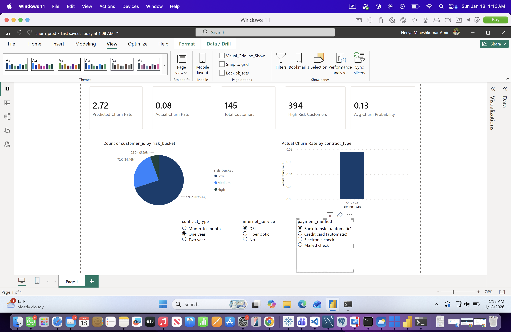
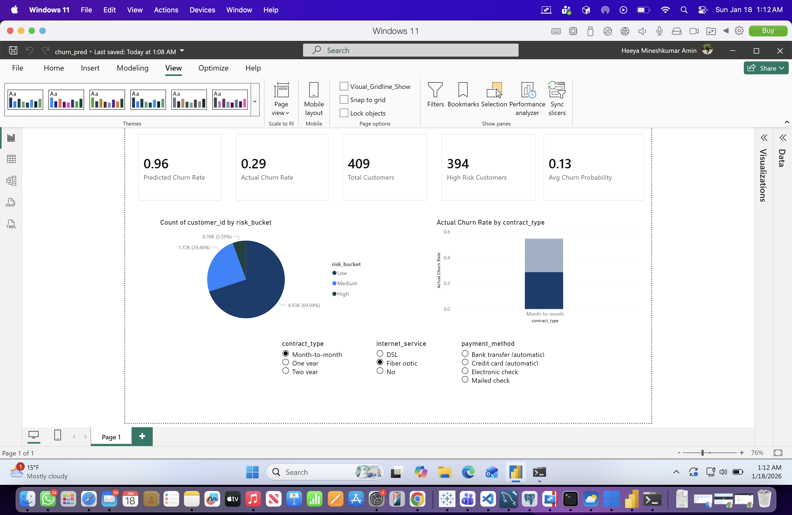
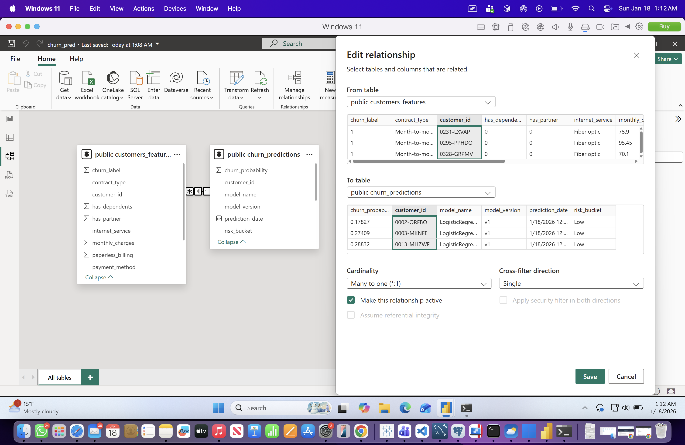
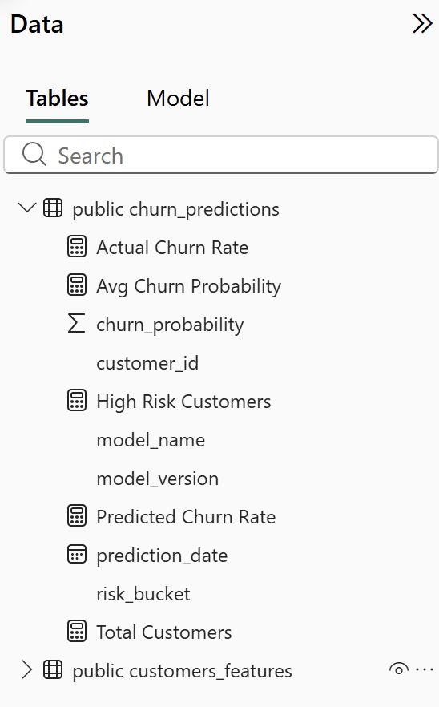

# Churn Intelligence Dashboard (Power BI + PostgreSQL)

This project demonstrates an end-to-end churn analytics workflow combining data engineering, machine learning outputs, and interactive business intelligence using Power BI.

The dashboard connects directly to a PostgreSQL database containing customer features and churn predictions, enabling real-time analysis of churn risk across different customer segments.

---

## Project Overview

Customer churn is a critical business problem. This project focuses on analyzing both actual churn behavior and model-predicted churn risk to support proactive retention strategies.

The solution includes:
- A PostgreSQL-backed data layer
- Machine learning churn predictions written back to the database
- An interactive Power BI dashboard for business analysis

---

## Key Features

- KPI cards for actual churn rate, predicted churn rate, total customers, high-risk customers, and average churn probability
- Churn risk distribution across Low, Medium, and High risk buckets
- Actual churn rate comparison by contract type
- Interactive slicers for contract type, internet service, and payment method
- Clean data model with proper relationships and reusable DAX measures

---

## Dashboard Screenshots

### Dashboard Overview

End-to-end churn intelligence dashboard showing key KPIs, risk distribution, churn rates, and customer segmentation with interactive filters.

### Interactive Analysis with Filters

Dashboard view with slicers applied (contract type, internet service, payment method) to analyze churn behavior across customer segments.

### Data Model & Relationships

Star-schema style data model connecting customer features and churn predictions using a many-to-one relationship on customer_id.

### Measures & Calculated Metrics

Custom DAX measures for actual churn rate, predicted churn rate, average churn probability, high-risk customers, and total customers.

---

## Data Model

- **public_customers_features**: customer demographics, services, and actual churn label  
- **public_churn_predictions**: model-generated churn probability, risk bucket, and metadata  

The tables are joined on `customer_id` using a many-to-one relationship to support accurate aggregation and filtering.

---

## Tools & Technologies

- Power BI Desktop
- PostgreSQL
- Python (data loading, model training, scoring)
- SQL
- DAX

---

## How This Dashboard Is Used

Business users can:
- Identify high-risk customers
- Compare actual vs predicted churn behavior
- Analyze churn trends by contract type and services
- Interactively filter data to support targeted retention strategies

---

## Author

Heeya Amin  
MS Data Science – Indiana University Bloomington
